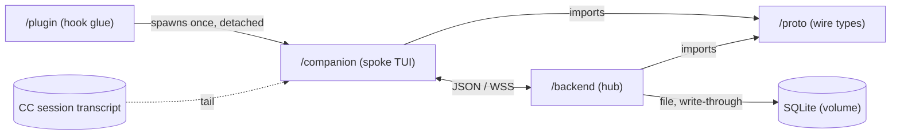
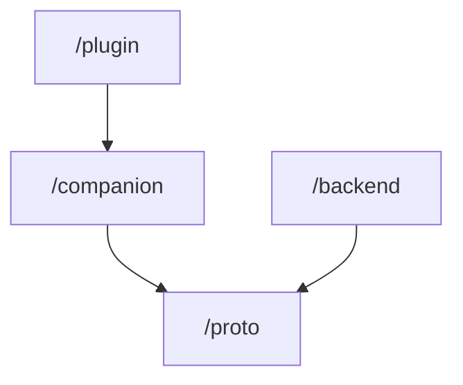
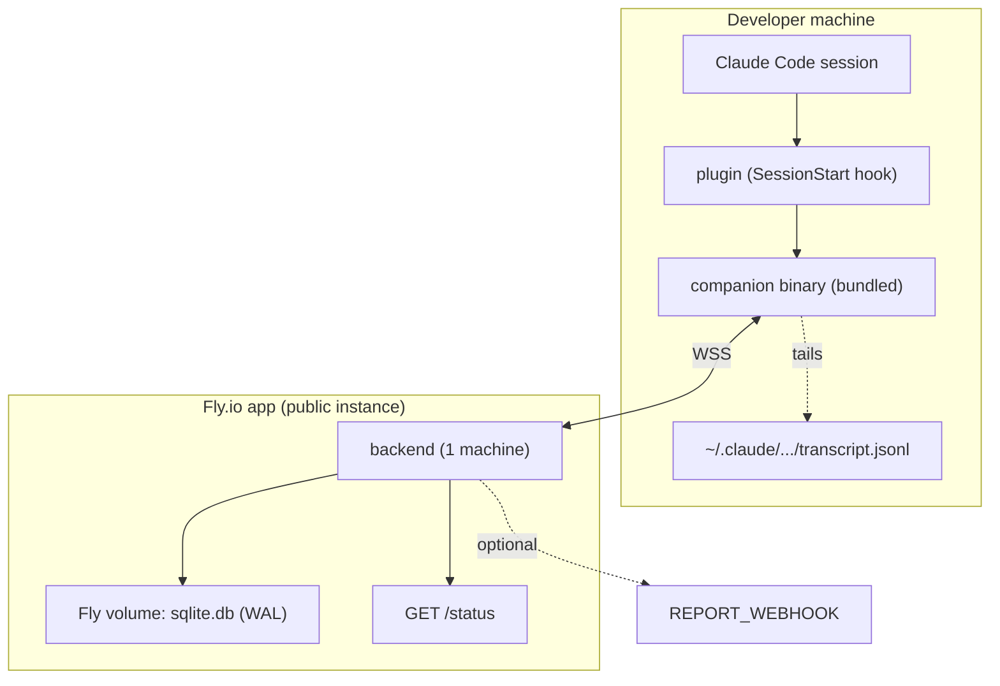
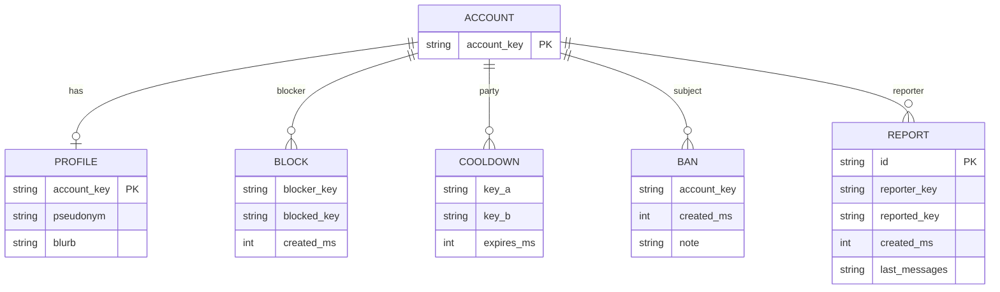

# Architecture Spine — Claude Think-Time Chat Roulette

## Design Paradigm

**Hub-and-spoke relay.** One authoritative backend (the hub) holds all queue, pairing, and
session state in memory. Companion clients (spokes) render and relay only — they hold no
authoritative state and never talk to each other. A spoke recovers from any fault by
reconnecting and re-announcing itself.

| Unit | Role | Directory |
| --- | --- | --- |
| `plugin` | Claude Code plugin: hook wiring + ships the companion binary. Spoke supervisor. | `/plugin` |
| `companion` | Long-lived Go TUI: transcript watch, websocket, chat UI, pane placement. The spoke. | `/companion` |
| `backend` | Go service: FIFO queue, pairing, relay, policy enforcement, persistence. The hub. | `/backend` |
| `proto` | Shared Go module: every wire message type + the protocol-version constant. | `/proto` |



Dependency direction: `plugin → companion`; `companion → proto`; `backend → proto`. Nothing
depends on `plugin`. `proto` depends on nothing.

## Invariants & Rules

`[ADOPTED]` marks a call inherited verbatim from the finalized PRD; untagged ADs are this
spine's own.

### AD-1 — Hub-and-spoke, backend authoritative

- **Binds:** all v1 units
- **Prevents:** divergent state ownership; peer-to-peer paths that bypass moderation
- **Rule:** all queue / pairing / active-session state lives in the backend and only there.
  Companions hold no authoritative state and never communicate companion-to-companion. A
  companion's only recovery action is to reconnect and re-announce (AD-17).

### AD-2 — Backend enforces all matching & moderation policy

- **Binds:** `backend`, `companion`
- **Prevents:** the open-source client becoming safety-load-bearing; two enforcement points drifting
- **Rule:** identity acceptance, eligibility (block / cooldown / ban), rate limiting, and
  keyword filtering are decided only by the backend. The companion renders outcomes and never
  gates on them locally. **Carve-out:** the first-run 18+ / safety gate (PRD UJ-5, FR43–44)
  is a *local precondition* in the companion — no server round-trip, no server-side
  attestation record; the companion simply does not connect until it is cleared.
  Rate-limit note: involuntary re-enqueues (AD-16) and grace resumes (AD-17) do not count
  against a key's match-rate limit — only user-initiated new matches do.

### AD-3 — Wire protocol: versioned JSON, defined once in `/proto`

- **Binds:** `proto`, `companion`, `backend`
- **Prevents:** client / server message-schema drift; an under-specified contract
- **Rule:** every websocket message is JSON matching a type declared in `/proto`; both units
  import `/proto`; no message shape exists elsewhere. Envelope:
  `{ "type": <snake_case>, "v": <int>, ...payload }`. The v1 set is:
  - **client→server:** `hello` (protocol version, account key), `ready`, `busy`, `chat_msg`
    (`client_msg_id`, `text`), `leave`, `block`, `report` (`last_n`), `profile_put`
    (`pseudonym`, `blurb`; empty = clear), `forget_me`, `note_put` (`text`), `heartbeat`
  - **server→client:** `queued`, `matched` (`session_id`, peer `pseudonym`/`blurb`, `opener`
    text), `chat_msg` (`text`), `session_ended`, `blocklist`, `profile_ack`, `error`
    (`code`, `msg`), `please_update`
  - `chat_msg` is **not** echoed to the sender; the companion renders its own outbound
    optimistically keyed by `client_msg_id`. `please_update` is its own type, sent before the
    socket closes (AD-5), never an `error` code.

### AD-4 — One session ID; every chat exit is one identical `session_ended`  `[ADOPTED]`

- **Binds:** `proto`, `companion`, `backend`
- **Prevents:** leaking which exit occurred — violates PRD FR19/FR21
- **Rule:** the backend mints exactly one `session_id` at pairing and returns it in the
  `matched` message for **every** chat. Peer leave, block, report, disconnect, and
  model-returned all terminate a chat with a single `session_ended` message carrying **no
  cause field and no session_id**. The companion always renders the same "your Claude is
  back" copy, and decides whether to offer "copy session ID" from its *local* persist state,
  never from message contents. On `leave` / burst-end the backend stops relaying at once:
  messages already received are delivered, later ones dropped, `session_ended` is the peer's
  last message.

### AD-5 — Protocol version negotiated on connect

- **Binds:** `companion`, `backend`
- **Prevents:** a stale plugin-bundled companion breaking against a newer deployed backend
- **Rule:** the companion sends its protocol version in `hello`. The backend accepts the
  current and previous minor; older gets a single `please_update` then close. Any breaking
  wire change bumps the minor.

### AD-6 — The companion alone determines think-time boundaries  `[ADOPTED]`

- **Binds:** `plugin`, `companion`, `backend`
- **Prevents:** three components holding three notions of when a chat should end
- **Rule:** only the companion decides busy-vs-back, by tailing the Claude Code session
  transcript file, and expresses it to the backend solely as `ready` / `busy`. Plugin hooks
  MAY nudge but are not authoritative. The backend never infers session state from timing.

### AD-7 — Plugin → companion is launch-only  `[ADOPTED]`

- **Binds:** `plugin`, `companion`
- **Prevents:** hook timing limits (30s `UserPromptSubmit` cap; post-turn `Stop`) becoming load-bearing
- **Rule:** the `SessionStart` hook spawns the companion once per Claude Code session,
  detached, with three arguments — transcript path, config-dir path, server URL. After spawn
  the plugin holds no channel to the companion.

### AD-8 — Single-writer state; it owns the queue, pairings, and live policy

- **Binds:** `backend`
- **Prevents:** FIFO races, double-matching, policy lost across restarts, split read/write paths
- **Rule:** exactly one goroutine mutates queue, pairing, and in-memory policy state, driven
  by a channel it consumes; all connection handlers interact with it only by sending on that
  channel. On startup it loads every block, cooldown, and ban from SQLite; thereafter SQLite
  is a **write-through durable mirror** and no other code path reads policy for a matching
  decision. It owns pairing teardown. **Matching (FR7–FR9):** scan from the queue head, pair
  the head with the first eligible successor (not blocked / on cooldown / banned / self); if
  none within a bounded scan, the head waits. **Cooldown (FR34):** a cooldown row is written
  only after a pairing lasts ~1 minute or both sides send ≥1 message — never at pairing time,
  and never for a pairing torn down inside the AD-17 grace window with no exchange.

### AD-9 — Profile: the backend copy is canonical

- **Binds:** `companion`, `backend`
- **Prevents:** two sources of truth for the pseudonym / blurb
- **Rule:** the companion edits a local draft and sends `profile_put` on change (full
  replace, not a patch). The backend stores the canonical profile and is the only origin of
  the pseudonym / blurb delivered to a peer in `matched`. `forget_me` drops all rows keyed to
  the account key (PRD NFR4).

### AD-10 — Data-at-rest rule  `[ADOPTED]`

- **Binds:** `backend`
- **Prevents:** any persistence path that violates PRD FR15 / NFR1
- **Rule:** message content is never written to disk or logs. Sole exception: a `report` row
  (the last N messages of that one chat), deleted once actioned. Persisted data is limited
  to: profiles, block lists, cooldown rows, bans, account-key rows, report rows, and a
  `schema_version` row. Empty-queue notes and rate-limit counters live in memory only.

### AD-11 — Account key: presented, not verified  `[ADOPTED]`

- **Binds:** `companion`, `backend`
- **Prevents:** reliance on a Claude-account identifier the platform does not expose
- **Rule:** the companion reads or creates a random UUID at a stable OS-config path outside
  the plugin directory and sends it in `hello`. The backend treats it as opaque and
  authoritative with no verification. (PRD OQ-3; evasion accepted.)

### AD-12 — Configuration is environment variables only

- **Binds:** `companion`, `backend`, deployment
- **Prevents:** config-file vs env drift between the Fly instance and self-hosted deploys
- **Rule:** no config files. Companion reads `SERVER_URL` (default: the public instance).
  Backend reads `PORT`, `DB_PATH`, `KEYWORDS_PATH`, optional `REPORT_WEBHOOK`.

### AD-13 — No admin HTTP surface; admin is a CLI on the same binary

- **Binds:** `backend`
- **Prevents:** an admin attack surface (and its auth burden) in v1
- **Rule:** the only HTTP endpoints are the websocket upgrade and `GET /status`. Maintainer
  actions (`backend ban`, `backend reports`, …) are subcommands writing the shared SQLite
  file. The `serve` process re-reads bans on a short interval (~10s) and on `SIGHUP`;
  `backend ban` writes the row and sends `SIGHUP` via pidfile when present — so FR40
  "immediately" means within that interval. SQLite is opened WAL + `busy_timeout` for the
  two-process access.

### AD-14 — Fail-open: never block or error the Claude Code session  `[ADOPTED]`

- **Binds:** `plugin`, `companion`
- **Prevents:** the plugin degrading the host session (PRD FR6 ×2, NFR6, NFR8)
- **Rule:** the `SessionStart` hook returns immediately, spawning the companion detached with
  a hard timeout. Any failure — spawn error, missing binary, unreachable backend, crashed
  companion — is swallowed; Claude Code proceeds untouched and no error surfaces in its UI.

### AD-15 — Content sanitization has one owner per direction

- **Binds:** `backend`, `companion`
- **Prevents:** companion and backend each assuming the other sanitizes — a safety-path divergence
- **Rule:** the **backend** is the single point that inerts/strips links, enforces message
  length caps, and rejects oversized or non-text frames on ingest — before relay and before
  the keyword filter. The **companion** renders all peer text as literal: no remote markup,
  no control sequences, no link activation. (PRD FR14, NFR11; addendum safety keystone.)

### AD-16 — The backend owns queue membership and the FR20 requeue

- **Binds:** `companion`, `backend`
- **Prevents:** double-enqueue, one key matched to two peers, spinner-forever, FR36 ambiguity
- **Rule:** the companion only sends `ready` / `busy`; the backend translates that into queue
  membership and owns silently re-enqueuing a still-busy user after any session end (PRD
  FR20). **One active connection per account key:** a second `hello` for a key already
  connected takes over — the prior connection gets `session_ended` + close (a person watches
  one Claude Code session at a time). This is how FR36 "exactly one concurrent session" is met.

### AD-17 — Reconnect grace window

- **Binds:** `backend`, `companion`
- **Prevents:** a wifi blip destroying a pairing and burning a cooldown; forced-requeue griefing
- **Rule:** on spoke disconnect the backend holds the pairing for a short grace window
  (~10s). A reconnect presenting the same `account key` + `session_id` resumes it. On expiry
  the peer gets `session_ended` and both sides are re-enqueued if still busy. Grace resumes
  and involuntary requeues are exempt from rate limiting (AD-2).

### AD-18 — Forward-only embedded schema migrations

- **Binds:** `backend`
- **Prevents:** an ad-hoc schema drifting across backend releases on a long-lived volume
- **Rule:** the backend embeds ordered SQL migrations and applies all pending ones on
  startup, gated by the `schema_version` row. No down-migrations in v1. (The data-at-rest
  parallel to AD-5.)

**Dependency direction** (who may import / depend on whom):



Nothing may depend on `plugin`; `proto` depends on nothing.

## Consistency Conventions

| Concern | Convention |
| --- | --- |
| Naming | Go packages lowercase, no underscores. Wire types are `PascalCase` structs in `/proto` with a `snake_case` `type` discriminator. SQLite tables `snake_case` plural. |
| Data & formats | IDs are UUIDv4 strings. `session_id` is an opaque, unguessable string minted by the backend (PRD FR26). Timestamps are Unix epoch milliseconds (`int64` on the wire, `INTEGER` in SQLite). Client-facing errors are an `error` message — never a transport close, except the AD-5 `please_update`. |
| State & cross-cutting | All queue / pairing / policy mutation goes through the AD-8 single writer. Message relay is in-memory only (AD-10). Logs are structured JSON to stdout, no message content, no account keys. Config via env only (AD-12). No authentication in v1 (AD-11). Transient IP data (rate-limiting only) is in-memory, never persisted or logged (PRD NFR2). The account key never appears in any server→client message a peer receives (PRD NFR3). |

## Stack

_Seed — verified current 2026-09-01; the code owns this once it exists. Pin exact patch versions at project init._

| Name | Version |
| --- | --- |
| Go | 1.27.x |
| charmbracelet/bubbletea | v2.0.x (v2 line — Charm's recommended start; pin with bubbles/lipgloss v2) |
| charmbracelet/bubbles | v2.2.x |
| charmbracelet/lipgloss | v2.0.x |
| coder/websocket | v1.8.15 |
| fsnotify/fsnotify | v1.10.1 (handle atomic-rename / rotation in the transcript watcher) |
| modernc.org/sqlite (pure-Go, no cgo) | v1.57.0 |
| Public instance | Fly.io — `shared-cpu-1x`, one machine, one volume, free shared IPv4 |
| Self-host | Docker + `docker-compose.yml` (same image) |

_Fly.io has had no free tier since 2024 — the public instance carries a small real bill (~$5–10/mo). Use the free shared IPv4, not a dedicated one._

## Structural Seed

### Containers & environments



- **Public instance:** one Fly machine + one volume; TLS at Fly; single-instance by design
  (one SQLite file, no horizontal scale in v1). Volume snapshots are the backup posture.
- **Self-host:** identical image via `docker compose up`; operator supplies a volume mount,
  env vars, and their own TLS reverse proxy.
- **Release flow:** CI cross-builds companion binaries (macOS arm64/x64, Linux, Windows),
  publishes the backend container image, attaches binaries to a GitHub release. Cross-built
  binaries are committed under `plugin/bin/<os>-<arch>/`; the hook resolves them via
  `${CLAUDE_PLUGIN_ROOT}`. Each plugin release pins one companion binary version.

### Persisted entities (SQLite)



The FIFO queue, active pairings, relayed messages, empty-queue notes, and rate-limit
counters are in-memory only and die with the process (AD-1, AD-10).

### Source tree

```text
claudingtin/
  proto/             # shared Go module: wire message types + PROTOCOL_VERSION
  backend/
    cmd/             # `backend serve`, `backend ban`, `backend reports`
    migrations/      # embedded, ordered, forward-only (AD-18)
  companion/         # Go TUI: transcript watcher, ws client, Bubble Tea v2 UI, pane placement
  plugin/
    bin/<os>-<arch>/ # committed cross-built companion binaries
    hooks/           # SessionStart launcher
  deploy/            # Dockerfile, docker-compose.yml, fly.toml, keywords.txt
  .github/workflows/ # cross-build + release
```

## Capability → Architecture Map

| PRD area | Lives in | Governed by |
| --- | --- | --- |
| F1 Think-time detection & session lifecycle | `companion` (+ `plugin` launch) | AD-6, AD-7, AD-14 |
| F2 FIFO matching & queue | `backend` | AD-1, AD-8, AD-16 |
| F3 The chat surface | `companion` | AD-2, AD-3, AD-10, AD-15 |
| F4 Exit convention & disconnect | `proto` + `companion` + `backend` | AD-4, AD-16, AD-17 |
| F5 Persist & commitment ramp (session IDs) | `companion` (toggle) + `backend` (mints ID) | AD-4, conventions |
| F6 Tiny profile | `companion` (edit) + `backend` (canonical) | AD-9 |
| F7 Openers | `backend` (selects, sends text in `matched`) | AD-1, AD-3 |
| F8 Block, cooldown, rate limiting | `backend` | AD-2, AD-8 |
| F9 Reporting & moderation | `backend` (report row + CLI) + `backend` keyword filter | AD-10, AD-13, AD-15 |
| F10 Onboarding, age gate, safety disclosure | `companion` (first-run, local) | AD-2 carve-out, AD-11 |
| F11 Idle experience (empty-queue note) | `backend` (holds note) + `companion` (offers) | AD-1, AD-10, AD-16 |
| NFR6/NFR8 fail-open | `plugin` + `companion` | AD-14 |
| NFR15 Status view | `backend` `GET /status` | AD-13 |

## Deferred

- **v2 reconnect webapp and its datastore** — separate initiative; this spine only avoids
  precluding it (session IDs are already opaque and backend-issued).
- **Pull-in matching, interest tags** — post-v1 matching-layer features; no v1 hook needed.
- **Multi-instance / horizontal scale, self-hosted pool federation** — single-instance is a
  deliberate v1 constraint (one SQLite file); revisit past hobby scale.
- **Exact transcript-parse edge cases** (interrupts, `SubagentStop`, format shifts) —
  implementation detail behind AD-6.
- **Rate-limit numeric values, keyword-list contents, grace-window and cooldown exact
  durations** — operational tuning; PRD OQ-5 / OQ-7, owned by the maintainer.

## Open Questions

- **The Claude Code session-transcript file location and JSONL schema are not a documented,
  stable contract** (PRD addendum §2). The companion depends on both (AD-6). Needs an
  implementation spike to pin the current format, build a defensive parser, and CI-test the
  full cross-build matrix (folds together with the `modernc.org/sqlite` Windows check).
